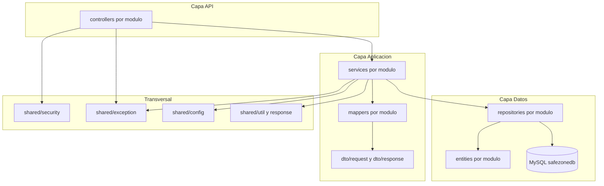

# SafeZone Backend

## 1. Descripcion del proyecto
Backend de la plataforma **SafeZone**, orientada al registro y seguimiento de denuncias de violencia familiar con atencion asistida y control de acceso por roles.

Este repositorio contiene:
- API REST de negocio por modulos funcionales.
- Persistencia JPA con MySQL.
- Seguridad con Spring Security.
- Migraciones con Flyway.
- Documentacion OpenAPI/Swagger.

## 2. Objetivo del backend
Proveer una API segura, modular y trazable para:
- autenticar usuarios,
- gestionar victimas, denuncias y casos,
- asignar profesionales y registrar seguimientos,
- gestionar citas, evidencias y notificaciones,
- mantener auditoria y configuracion del sistema,
- generar reportes operativos.

## 2.1 Estado de implementacion
- Reestructura aplicada a arquitectura **por funcionalidad** (feature-first).
- Paquetes antiguos por capa tecnica (`domain`, `web`, `persistance`) migrados a modulos de negocio.
- Compilacion verificada con `mvn -q -DskipTests compile`.
- Implementacion de metodos de servicio aun parcial en varios modulos (placeholders pendientes).

## 3. Arquitectura y stack
| Stack | Uso en el proyecto |
|---|---|
| Java 21 | Lenguaje base del backend. |
| Spring Boot 3.5.13 | Framework principal para API REST. |
| Spring Web | Endpoints HTTP y controladores. |
| Spring Data JPA | Persistencia ORM y repositorios. |
| Spring Security | Seguridad y control de acceso. |
| Spring Validation | Validacion de requests (`@Valid`). |
| MySQL Connector/J | Conexion a base de datos MySQL. |
| Flyway | Migraciones versionadas de BD. |
| Springdoc OpenAPI | Swagger UI y especificacion OpenAPI. |
| Lombok | Reduccion de boilerplate. |
| JUnit + Spring Test | Pruebas de backend. |

## 4. Dependencias principales
Dependencias declaradas en `pom.xml`:

**Dependencias de produccion:**
- `spring-boot-starter-web`
- `spring-boot-starter-data-jpa`
- `spring-boot-starter-security`
- `spring-boot-starter-validation`
- `mysql-connector-j`
- `flyway-core`
- `springdoc-openapi-starter-webmvc-ui` `2.8.16`
- `lombok`

**Dependencias de pruebas:**
- `spring-boot-starter-test`
- `spring-security-test`

## 5. Estructura del proyecto
```text
safeZoneBackend/
├── src/
│   ├── main/
│   │   ├── java/com/utp/safezonebackend/
│   │   │   ├── auth/                     # Autenticacion y refresh token.
│   │   │   ├── usuarios/                 # Gestion de usuarios y roles.
│   │   │   ├── victimas/                 # Alias y operaciones de victimas.
│   │   │   ├── denuncias/                # Registro y consulta de denuncias.
│   │   │   ├── casos/                    # Ciclo de vida de casos.
│   │   │   ├── asignaciones/             # Asignacion de profesionales.
│   │   │   ├── seguimientos/             # Seguimiento de caso.
│   │   │   ├── citas/                    # Programacion y atencion de citas.
│   │   │   ├── evidencias/               # Evidencias digitales asociadas.
│   │   │   ├── notificaciones/           # Alertas y notificaciones.
│   │   │   ├── configuracion/            # Parametros globales del sistema.
│   │   │   ├── auditoria/                # Trazabilidad de acciones.
│   │   │   ├── reportes/                 # Consultas y reportes operativos.
│   │   │   ├── shared/                   # Seguridad, excepciones y utilidades transversales.
│   │   │   └── ProyectoIntegradorBackendApplication.java
│   │   └── resources/
│   │       ├── application.properties
│   │       └── bd/
│   │           └── safezonedb_schema.md
│   └── test/
│       └── java/
├── informe/
├── pom.xml
└── README.md
```

## 6. Estructura interna por modulo
Cada modulo sigue una organizacion consistente:

- `controller/` endpoints REST.
- `service/` reglas de negocio del modulo.
- `repository/` acceso a datos.
- `entity/` entidades persistentes.
- `dto/request` y `dto/response` contratos API.
- `mapper/` conversion entidad <-> DTO.
- `enums/` (cuando el modulo lo requiere).

## 7. Modulos funcionales del backend
Modulos actualmente definidos:
- `auth`
- `usuarios`
- `victimas`
- `denuncias`
- `casos`
- `asignaciones`
- `seguimientos`
- `citas`
- `evidencias`
- `notificaciones`
- `configuracion`
- `auditoria`
- `reportes`

## 8. Seguridad y acceso
Modelo de seguridad esperado:
- autenticacion por credenciales en `auth`.
- control de acceso por rol para endpoints sensibles.
- trazabilidad de operaciones criticas en `auditoria`.
- configuracion de seguridad operativa en `configuracion`.

Roles de negocio del sistema:
- `VICTIMA`
- `RECEPCIONISTA`
- `PSICOLOGO`
- `DEFENSOR`
- `SOPORTE`
- `ADMIN`

## 9. Integracion con base de datos
Base objetivo: `safezonedb`.

Fuentes en repositorio:
- `src/main/resources/application.properties`
- `src/main/resources/bd/safezonedb_schema.md`

Tablas principales (segun modelo del proyecto):
- `usuarios`
- `victimas_alias`
- `denuncias`
- `casos`
- `asignaciones_caso`
- `seguimientos_caso`
- `citas`
- `evidencias`
- `notificaciones`
- `configuracion_sistema`
- `auditoria`
- `refresh_tokens`

## 10. Configuracion local
Archivo principal:
- `src/main/resources/application.properties`

Claves relevantes:
- `server.port`
- `spring.datasource.*`
- `spring.jpa.*`
- `spring.flyway.*`
- `springdoc.*`

## 11. Endpoints y documentacion API
Con `springdoc-openapi` habilitado:

- Swagger UI: `http://localhost:8082/swagger-ui/index.html`
- OpenAPI JSON: `http://localhost:8082/v3/api-docs`

## 12. Ejecucion local
Compilar:
```bash
mvn clean compile
```

Ejecutar:
```bash
mvn spring-boot:run
```

Build:
```bash
mvn clean package
```

## 13. Pruebas
Ejecutar pruebas:
```bash
mvn test
```

Estado actual:
- Existe dependencia de testing.
- Se recomienda reforzar cobertura por modulo (`service` y `controller`) en siguientes iteraciones.

## 14. Diagrama de arquitectura por modulos


## 15. Nota de alcance
Este README documenta el backend y su estructura actual por funcionalidad.

La reestructura organiza mejor el dominio por modulo, pero no implica que toda la logica de cada servicio este completamente implementada. El siguiente paso natural es cerrar implementaciones pendientes y cubrirlas con pruebas por modulo.
