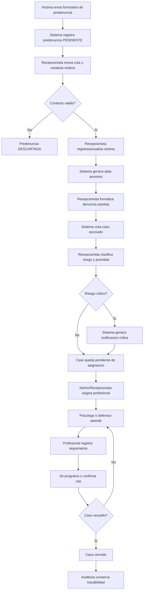
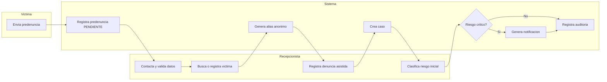
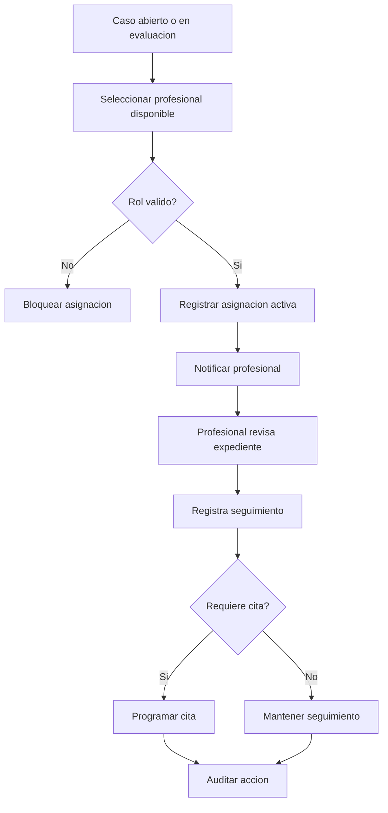

# Logica de Negocio - SafeZone

## 1. Enfoque del sistema
SafeZone no es solo un panel administrador. Es una plataforma web para registrar, clasificar y dar seguimiento a denuncias de violencia familiar bajo un modelo de atencion asistida.

La victima puede iniciar un reporte y consultar informacion autorizada, pero la denuncia formal y la gestion del caso quedan a cargo del personal autorizado. El sistema debe separar claramente lo que puede hacer cada rol para proteger la identidad de la victima y mantener trazabilidad.

Fuente principal:
- Requerimientos funcionales del proyecto.

Fuente de apoyo:
- Avance 1: objetivos, arquitectura, entidades, controladores y modelo de datos.
- `EsquemaBD.sql`: tablas, estados, relaciones y roles.

## 2. Roles del negocio
| Rol | Responsabilidad principal | Tipo de acceso |
|---|---|---|
| `VICTIMA` | Reportar hechos, consultar sus denuncias, casos, citas, evidencias y notificaciones permitidas. | Portal usuario con header/footer, sin sidebar. |
| `RECEPCIONISTA` | Atender predenuncias, contactar victima, registrar denuncia asistida, clasificar riesgo inicial y crear caso. | Panel operativo. |
| `PSICOLOGO` | Atender casos asignados, registrar observaciones, acciones y proximas acciones. | Panel profesional. |
| `DEFENSOR` | Atender casos asignados desde el enfoque legal, registrar acciones y seguimiento. | Panel profesional. |
| `ADMIN` | Administrar usuarios, roles, configuracion, auditoria y reportes. | Panel administrativo completo. |

## 3. Modulos funcionales
| Modulo | Requerimientos | Tablas base |
|---|---|---|
| Autenticacion y seguridad | RF-01, RF-02, RF-10, RF-18, RF-20 | `usuarios`, `refresh_tokens`, `configuracion_sistema`, `auditoria` |
| Predenuncias y contacto inicial | RF-12, RF-16, RF-18 | `pre_denuncias`, `usuarios`, `victimas_alias` |
| Gestion de victimas | RF-03, RF-11, RF-16 | `usuarios`, `victimas_alias` |
| Casos y denuncias | RF-04, RF-06, RF-08, RF-12, RF-13, RF-15, RF-17 | `casos`, `denuncias`, `seguimientos_caso`, `notificaciones` |
| Asignacion de profesionales | RF-14 | `asignaciones_caso`, `usuarios`, `casos` |
| Citas y atencion | RF-05, RF-19 | `citas`, `casos`, `usuarios` |
| Evidencias | RF-09 | `evidencias`, `denuncias`, `casos`, `seguimientos_caso` |
| Reportes y estadistica | RF-07 | `denuncias`, `casos`, `citas`, `asignaciones_caso` |

## 4. Flujo principal del negocio


## 4.1 Proceso BPMN textual - Predenuncia y formalizacion asistida
Este proceso representa el flujo principal: la victima inicia una predenuncia y el personal autorizado formaliza la denuncia solo despues de validar contacto e informacion minima.

| Carril | Actividad | Resultado |
|---|---|---|
| Victima | Completa formulario inicial de predenuncia. | Registro en `pre_denuncias` con estado `PENDIENTE`. |
| Recepcionista | Revisa predenuncia y contacta a la victima. | Predenuncia en `EN_CONTACTO` o `DESCARTADA`. |
| Recepcionista | Verifica si la victima ya existe. | Victima identificada o pendiente de registro. |
| Recepcionista | Registra datos principales y contacto seguro. | Usuario con rol `VICTIMA`. |
| Sistema | Genera alias anonimo unico. | Registro en `victimas_alias`. |
| Recepcionista | Registra denuncia asistida. | Registro en `denuncias`. |
| Sistema | Crea caso asociado a la victima y denuncia. | Registro en `casos`. |
| Sistema | Marca predenuncia como formalizada. | `pre_denuncias.estado = FORMALIZADA`. |
| Recepcionista | Aplica evaluacion inicial. | Nivel de riesgo y prioridad. |
| Sistema | Evalua si el riesgo es critico. | Alerta automatica si corresponde. |
| Sistema | Registra auditoria del proceso. | Evento en `auditoria`. |

Reglas del proceso:
- La denuncia formal no debe quedar sin victima asociada.
- No se crea `denuncias` ni `casos` si la predenuncia no fue validada por recepcionista.
- Toda predenuncia debe terminar en `FORMALIZADA` o `DESCARTADA`.
- La victima debe tener alias activo para proteger su identidad operativa.
- Si el caso es critico, el sistema debe generar notificacion inmediata.
- El registro debe quedar trazado con actor, fecha y resultado.



## 4.2 Proceso BPMN textual - Asignacion y atencion del caso
| Carril | Actividad | Resultado |
|---|---|---|
| Admin/Recepcionista | Revisa casos abiertos o en evaluacion. | Caso seleccionado. |
| Admin/Recepcionista | Selecciona profesional segun rol y disponibilidad. | Psicologo o defensor elegido. |
| Sistema | Registra asignacion activa. | Registro en `asignaciones_caso`. |
| Sistema | Notifica al profesional. | Notificacion de nueva asignacion. |
| Profesional | Revisa expediente autorizado. | Caso en atencion. |
| Profesional | Registra seguimiento, observaciones y proximas acciones. | Registro en `seguimientos_caso`. |
| Profesional/Recepcionista | Programa cita si corresponde. | Registro en `citas`. |
| Sistema | Audita acciones. | Trazabilidad completa. |

Reglas del proceso:
- Solo `PSICOLOGO` y `DEFENSOR` pueden ser asignados como profesionales.
- El profesional solo debe ver casos asignados.
- La asignacion debe indicar si esta activa o finalizada.
- Toda reasignacion debe conservar historial.
- Las observaciones forman parte del expediente.



## 4.3 Proceso BPMN textual - Citas y confirmacion de atencion
| Carril | Actividad | Resultado |
|---|---|---|
| Recepcionista/Profesional | Solicita programar cita. | Datos de cita ingresados. |
| Sistema | Valida rango de fecha y disponibilidad. | Cita valida o rechazada. |
| Sistema | Registra cita programada. | Estado `PROGRAMADA`. |
| Victima | Consulta cita. | Informacion visible en portal. |
| Profesional | Confirma, cancela o marca atencion. | Estado actualizado. |
| Sistema | Registra auditoria y notificacion si aplica. | Trazabilidad y aviso. |

Reglas del proceso:
- `fecha_fin` debe ser mayor que `fecha_inicio`.
- La cita debe tener caso, victima y especialista.
- Los estados validos son `PROGRAMADA`, `CONFIRMADA`, `CANCELADA`, `ATENDIDA`, `NO_ASISTIO`.
- Un cambio de estado debe quedar auditado.

## 4.4 Proceso BPMN textual - Consulta de historial por victima
| Carril | Actividad | Resultado |
|---|---|---|
| Victima | Inicia sesion. | Acceso autenticado. |
| Sistema | Verifica rol y permisos. | Acceso permitido o denegado. |
| Victima | Consulta historial. | Lista autorizada de denuncias/casos/citas/evidencias. |
| Sistema | Oculta informacion interna no permitida. | Datos filtrados por rol. |
| Sistema | Audita acceso a expediente si aplica. | Trazabilidad. |

Reglas del proceso:
- La victima solo ve informacion asociada a su usuario.
- No debe ver notas internas restringidas de psicologos, defensores o admin.
- El historial debe mostrar estado del caso, citas, evidencias permitidas y notificaciones relevantes.
- El acceso a expedientes sensibles debe auditarse.

## 4.5 Proceso BPMN textual - Administracion y auditoria
| Carril | Actividad | Resultado |
|---|---|---|
| Admin | Gestiona usuarios y roles. | Usuarios activos/inactivos y roles asignados. |
| Admin | Configura reglas de seguridad. | Parametros actualizados. |
| Sistema | Aplica configuracion en autenticacion/sesion. | Seguridad operativa. |
| Admin | Consulta auditoria. | Eventos filtrados por actor, entidad o fecha. |
| Sistema | Mantiene eventos inalterables. | Trazabilidad confiable. |

Reglas del proceso:
- Solo admin debe modificar roles y configuracion sensible.
- La auditoria no se edita ni elimina desde frontend.
- La configuracion debe guardar responsable de creacion/actualizacion.

## 5. Ciclo de vida del caso
La base de datos actual define en `casos.estado` los mismos estados de los requerimientos:
- `REGISTRADO`
- `EN_EVALUACION`
- `EN_ATENCION`
- `DERIVADO`
- `CERRADO`
- `ARCHIVADO`

Conclusion de coherencia:
- Requerimientos funcionales y base de datos ya estan alineados en el ciclo de vida del caso.
- Frontend y backend deben trabajar directamente con estos estados, sin mapeos intermedios.

Propuesta de flujo:
```text
REGISTRADO
  -> EN_EVALUACION
  -> EN_ATENCION
  -> DERIVADO
  -> CERRADO
  -> ARCHIVADO
```

Reglas:
- Un caso nace cuando existe una victima y una denuncia registrada.
- Un caso critico debe disparar notificacion.
- Un caso cerrado no debe aceptar nuevas asignaciones activas.
- Un caso archivado solo debe ser consultable por roles autorizados.
- Todo cambio de estado debe generar auditoria.

## 5.1 Transiciones recomendadas del caso
| Estado origen | Estado destino | Actor permitido | Condicion |
|---|---|---|---|
| `REGISTRADO` | `EN_EVALUACION` | Recepcionista | Denuncia registrada y datos minimos completos. |
| `EN_EVALUACION` | `EN_ATENCION` | Recepcionista/Admin | Riesgo clasificado y caso asignado. |
| `EN_ATENCION` | `DERIVADO` | Psicologo/Defensor/Admin | Caso requiere atencion externa o cambio de responsable. |
| `EN_ATENCION` | `CERRADO` | Psicologo/Defensor/Admin | Atencion concluida y seguimiento final registrado. |
| `DERIVADO` | `EN_ATENCION` | Recepcionista/Admin | Se confirma nueva atencion interna. |
| `CERRADO` | `ARCHIVADO` | Admin | Caso cerrado sin actividad pendiente. |

Validaciones:
- No cerrar un caso con citas programadas pendientes.
- No cerrar un caso critico sin seguimiento registrado.
- No archivar un caso abierto o en atencion.
- No cambiar estado sin registrar actor y fecha.
- No permitir transiciones directas no definidas, por ejemplo:
  - `REGISTRADO -> CERRADO`
  - `REGISTRADO -> ARCHIVADO`
  - `EN_EVALUACION -> ARCHIVADO`
  - `DERIVADO -> CERRADO` (sin retorno previo a `EN_ATENCION`)

## 5.2 Niveles de riesgo y prioridad
La denuncia usa `nivel_riesgo`:
- `BAJO`
- `MEDIO`
- `ALTO`
- `CRITICO`

El caso usa `prioridad`:
- `BAJA`
- `MEDIA`
- `ALTA`
- `CRITICA`

Regla recomendada:
| Nivel de riesgo | Prioridad sugerida | Accion del sistema |
|---|---|---|
| `BAJO` | `BAJA` | Registrar caso y permitir seguimiento regular. |
| `MEDIO` | `MEDIA` | Registrar caso y recomendar evaluacion. |
| `ALTO` | `ALTA` | Priorizar asignacion profesional. |
| `CRITICO` | `CRITICA` | Generar notificacion critica y exigir atencion prioritaria. |

El formulario de evaluacion de riesgo debe terminar asignando nivel de riesgo y prioridad. La regla exacta de puntaje queda pendiente de definicion, pero el frontend debe estar preparado para mostrar resultado y justificacion.

## 6. Registro de victima
Requerimientos relacionados:
- RF-03: Registrar victimas.
- RF-11: Generar anonimato a la victima.
- RF-16: Historial de atencion de la victima.

Reglas:
- Toda victima debe existir como usuario con rol `VICTIMA`.
- La identidad operativa debe poder manejarse con `victimas_alias.alias_codigo`.
- El alias debe ser unico.
- La informacion sensible debe mostrarse solo a roles autorizados.
- El historial debe consolidar denuncias, casos, citas, seguimientos y evidencias.

Vista esperada:
- Admin/recepcionista: puede registrar y consultar victimas.
- Victima: puede ver su perfil y su historial autorizado.

## 7. Registro de denuncia asistida
Requerimientos relacionados:
- RF-04: Clasificar el caso.
- RF-12: Registro de denuncia asistida.
- RF-13: Gestion de casos.
- RF-17: Busqueda y filtros.

Reglas:
- El formulario de victima inicia como predenuncia en `pre_denuncias`.
- Solo recepcionista/admin formaliza una predenuncia a denuncia oficial.
- La denuncia debe asociarse a una victima y a un caso.
- Debe registrar descripcion, tipo de violencia, fecha del incidente, distrito, referencia y nivel de riesgo.
- La denuncia puede marcarse como anonima.
- El nivel de riesgo debe ser `BAJO`, `MEDIO`, `ALTO` o `CRITICO`.
- Una denuncia con riesgo `CRITICO` debe generar notificacion prioritaria.
- La denuncia no debe eliminarse fisicamente; debe usarse inactivacion logica.

Vista esperada:
- Recepcionista: revisa predenuncias y registra denuncia asistida.
- Victima: puede iniciar predenuncia y consultar sus denuncias formalizadas.
- Admin: puede consultar y auditar.

## 8. Asignacion de profesionales
Requerimiento relacionado:
- RF-14: Asignacion de profesionales.

Reglas:
- Solo usuarios con rol `PSICOLOGO` o `DEFENSOR` pueden ser asignados como profesionales.
- Una asignacion debe tener caso, profesional, rol profesional y responsable de asignacion.
- Debe controlarse si la asignacion esta activa.
- Un caso puede tener mas de una asignacion, por ejemplo psicologo y defensor.
- La reasignacion debe cerrar o inactivar la asignacion previa.

Vista esperada:
- Admin/recepcionista: asigna profesionales.
- Psicologo/defensor: ve solo casos asignados.

## 9. Seguimiento y expediente
Requerimientos relacionados:
- RF-06: Registrar observaciones.
- RF-16: Historial de atencion.
- RF-20: Auditoria de acciones.

Reglas:
- Cada seguimiento pertenece a un caso.
- El autor debe ser psicologo, defensor o admin.
- Debe registrar tipo de seguimiento, contenido, proxima accion y fecha de proxima accion si aplica.
- Los seguimientos forman parte del expediente del caso.
- La victima solo debe ver informacion permitida, no necesariamente todas las notas internas.

Vista esperada:
- Psicologo/defensor: registra seguimiento.
- Admin: revisa expediente completo segun permisos.
- Victima: ve historial resumido o autorizado.

## 10. Citas y atencion
Requerimientos relacionados:
- RF-05: Gestionar citas.
- RF-19: Confirmacion de atencion realizada.

Estados definidos en `citas.estado`:
- `PROGRAMADA`
- `CONFIRMADA`
- `CANCELADA`
- `ATENDIDA`
- `NO_ASISTIO`

Reglas:
- Toda cita debe estar asociada a caso, victima y especialista.
- El tipo de cita debe ser `PSICOLOGIA` o `LEGAL`.
- La fecha fin debe ser mayor que la fecha inicio.
- Debe validarse disponibilidad del especialista.
- La confirmacion de atencion debe actualizar estado y dejar auditoria.

Vista esperada:
- Recepcionista/admin: programa o reprograma.
- Psicologo/defensor: confirma atencion.
- Victima: consulta citas.

## 11. Evidencias digitales
Requerimiento relacionado:
- RF-09: Registrar evidencias digitales.

Reglas:
- Toda evidencia debe asociarse a un caso.
- Puede asociarse adicionalmente a denuncia o seguimiento.
- Debe registrar nombre, MIME type, tamano, URL de almacenamiento y hash si aplica.
- La evidencia no debe eliminarse fisicamente desde la operacion normal.
- El acceso debe restringirse por rol.

Vista esperada:
- Recepcionista/profesional: registra evidencia.
- Victima: puede consultar evidencias permitidas.
- Admin: audita evidencias.

## 12. Notificaciones
Requerimiento relacionado:
- RF-08: Enviar notificaciones.

Tipos definidos:
- `RIESGO_CRITICO`
- `SISTEMA`
- `RECORDATORIO`

Prioridades definidas:
- `BAJA`
- `MEDIA`
- `ALTA`
- `CRITICA`

Reglas:
- Caso critico debe generar notificacion `RIESGO_CRITICO`.
- Nueva asignacion debe notificar al profesional.
- Cita proxima debe generar recordatorio.
- Cambio de estado importante debe notificar a usuarios responsables.
- La notificacion debe poder marcarse como leida.

## 13. Reportes
Requerimiento relacionado:
- RF-07: Generar reportes.

Filtros minimos:
- rango de fechas,
- tipo de violencia,
- nivel de riesgo,
- estado del caso,
- distrito,
- profesional asignado.

Indicadores esperados:
- cantidad de denuncias registradas,
- casos por nivel de riesgo,
- casos por estado,
- citas atendidas/canceladas/no asistidas,
- tiempos de atencion,
- profesionales con carga asignada.

## 14. Auditoria
Requerimiento relacionado:
- RF-20: Auditoria de acciones.

Reglas:
- Registrar acciones criticas: creacion, actualizacion, inactivacion, acceso a expediente y cambio de estado.
- Registrar actor, rol, accion, entidad, resultado, detalle, antes, despues, IP, agente y codigo de solicitud.
- La auditoria debe ser consultable por admin autorizado.
- La auditoria no debe modificarse desde el frontend.

## 15. Reglas transversales
- Usar eliminacion logica mediante `activo`, `fecha_inactivacion` e `inactivado_por`.
- Mostrar datos sensibles solo segun rol.
- Mantener trazabilidad de creacion, actualizacion e inactivacion.
- Separar portal de victima del panel administrativo.
- El portal de victima usa header/footer y no sidebar.
- El panel administrativo puede usar sidebar.
- Los profesionales no deben ver casos no asignados.
- El administrador no debe reemplazar el flujo operativo; debe configurar, auditar y supervisar.

## 15.1 Matriz de permisos funcionales
| Funcionalidad | Victima | Recepcionista | Psicologo | Defensor | Admin |
|---|---:|---:|---:|---:|---:|---:|
| Iniciar sesion | Si | Si | Si | Si | Si | Si |
| Consultar panel por rol | Si | Si | Si | Si | Si | Si |
| Registrar victima | No | Si | No | No | No | Si |
| Generar alias | No | Si | No | No | No | Si |
| Registrar predenuncia | Si | Si | No | No | No | Si |
| Gestionar predenuncias | No | Si | No | No | Consulta | Si |
| Registrar denuncia asistida | Parcial | Si | No | No | No | Si |
| Consultar sus denuncias | Si | No | No | No | No | No |
| Consultar todas las denuncias | No | Si | No | No | Si | Si |
| Gestionar casos | No | Si | Solo asignados | Solo asignados | Consulta | Si |
| Cambiar estado de caso | No | Si | Segun asignacion | Segun asignacion | No | Si |
| Asignar profesionales | No | Si | No | No | No | Si |
| Registrar seguimiento | No | No | Si | Si | No | Si |
| Programar citas | No | Si | Si | Si | No | Si |
| Confirmar atencion | No | No | Si | Si | No | Si |
| Registrar evidencias | Segun flujo | Si | Si | Si | No | Si |
| Consultar reportes | No | No | No | No | Si | Si |
| Configurar seguridad | No | No | No | No | No | Si |
| Consultar auditoria | No | No | No | No | Si | Si |

Nota de coherencia de permisos:

## 15.2 Datos sensibles y visibilidad
Datos sensibles:
- nombres y apellidos de la victima,
- DNI,
- correo,
- telefono,
- distrito y direccion de referencia,
- descripcion de denuncia,
- evidencias,
- seguimientos profesionales.

Reglas:
- En pantallas operativas debe priorizarse el alias cuando no sea indispensable mostrar identidad completa.
- La identidad completa solo debe mostrarse a roles con necesidad funcional.
- La victima debe ver su propia informacion, pero no datos internos de otros actores.
- Reportes deben agregarse por indicadores y evitar exponer informacion personal.

## 15.3 Eventos que deben generar auditoria
- Inicio de sesion exitoso o fallido.
- Cierre de sesion.
- Registro de victima.
- Registro y actualizacion de predenuncia.
- Generacion o cambio de alias.
- Registro de denuncia.
- Creacion de caso.
- Clasificacion de riesgo.
- Cambio de estado del caso.
- Asignacion o cierre de asignacion profesional.
- Registro de seguimiento.
- Programacion, cancelacion o confirmacion de cita.
- Registro o inactivacion de evidencia.
- Cambio de rol o estado de usuario.
- Cambio de configuracion de seguridad.
- Acceso a expediente sensible.

## 15.4 Relacion frontend - backend esperada
El frontend no debe decidir reglas criticas de seguridad por si solo. Debe:
- mostrar formularios y estados,
- validar campos basicos,
- enviar solicitudes al backend,
- mostrar errores de negocio,
- respetar permisos recibidos,
- ocultar acciones no permitidas para el rol.

El backend debe:
- validar permisos reales,
- aplicar reglas de negocio criticas,
- persistir datos,
- generar auditoria,
- emitir notificaciones,
- proteger informacion sensible.

## 16. Prioridad sugerida de implementacion
1. Autenticacion y roles.
2. Layout publico, usuario y admin.
3. Registro de victima y alias.
4. Registro de denuncia asistida.
5. Creacion y clasificacion de caso.
6. Dashboard por rol.
7. Asignaciones.
8. Seguimientos.
9. Citas.
10. Evidencias.
11. Notificaciones.
12. Reportes.
13. Auditoria y configuracion avanzada.

## 17. Pendientes de decision
- Alinear estados de caso entre requerimientos y base de datos.
- Definir si la victima registra denuncia completa o solo inicia reporte para atencion asistida.
- Definir que partes del seguimiento puede ver la victima.
- Definir reglas exactas para clasificar riesgo.
- Definir almacenamiento real de evidencias.
- Definir politicas de sesion, contrasena y expiracion.
